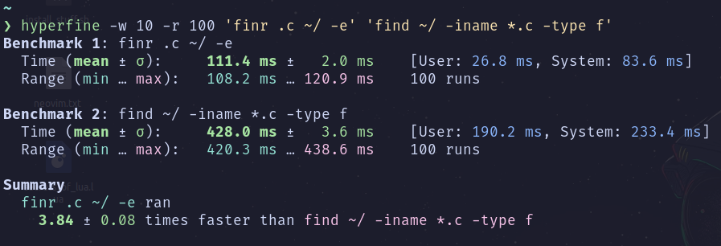
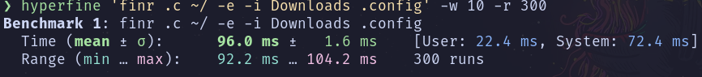

# Finr

Finr is a command line tool that recursively searches files and directories with a given pattern. Built with the phrase "Work smarter not harder" in mind.

## Table of contents

-   [Installation](#installation)
-   [Usage](#usage)
-   [Similar tools](#similar-tools)

## Comparing finr and find



### Finr Ignoring Directories



## Installation

Assumes that you have rust and cargo installed.

```sh
cargo install finr
```

## Usage

Print help message

```sh
finr --help
```

Search for `.rs` files in the current directory.
By default finr searches for files in the current directory.
If you want to search for a directory use `-t d`.

```sh
finr .rs -e
```

Search for directories with _node_modules_ in the name.

```sh
finr node_modules -t d
```

Searching for files that contain `main` in the name

```sh
finr main
```

Search for `.rs` files starting at the /home/ directory while ignoring some directories.

```sh
finr .rs ~/ -e -i Files Videos Downloads .config .local
```

### Similar tools

-   [fd-find](https://crates.io/crates/fd-find)

### Is this another find replacement?

Nope. Find is still a great tool with more feature than finr.
Since finr is new,
