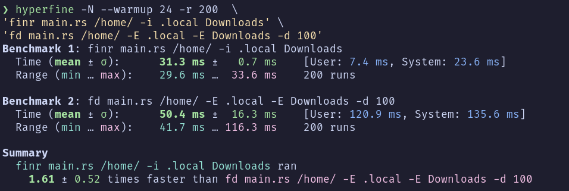

# Finr

Recursively search for files and directories with a pattern, ignoring irrelevant directories.

## Table of contents

-   [Motivation](#motivation)
-   [Installation](#installation)
-   [Build from source](#build-from-source)
-   [Usage](#usage)
-   [About find and fd](#what-about-find-or-fd-find)
-   [Similar tools](#similar-tools)

## Comparing [finr](https://crates.io/crates/finr) and and [fd-find](https://crates.io/crates/fd-find)



## Motivation

I developed finr to quickly find files and directories in the filesystem, ignoring certain directories that usually do not contain what I'm looking for.
Finr is heavily inspired by ripgrep, specifically the ignore directories part.
I wanted a tool that was fast and easy to use. So it may not be what you're looking for.

## Installation

Assumes that you have rust and cargo installed.

```sh
cargo install finr
```

## Build from source

```sh
git clone https://github.com/Gers2017/finr && \
cd finr && \
cargo build --release
```

## Usage

Print help message

```sh
finr --help
```

Finr looks for **files** and starts at the **current directory** by default.
To search for a directory, use `-t d` (--type directory).
The max-depth is arbitrarily set to 100.

Search for .rs files using regex (Uses the [regex crate](https://crates.io/crates/regex))

```sh
finr '.+\.rs$' --regex
```

finr searching for `.md` files with a max depth of 200

```sh
finr '.+\.md$' --regex --max-depth 200
```

Search for files with `.rs`. Starting at the current directory. (Uses [ends_with](https://doc.rust-lang.org/std/string/struct.String.html#method.ends_with))

```sh
finr .rs -e
```

Search for directories that contain `_node_modules_` in the name.

```sh
finr node_modules -t d
```

Searching for files that contain `main` in the name (Uses [contains](https://doc.rust-lang.org/std/string/struct.String.html#method.contains))

```sh
finr main
```

Search for files with `.rs` starting at the /home/ directory while ignoring some directories.

```sh
finr .rs ~/ -e -i Files Videos Downloads .config .local
```

Search for files that contain `main.c` starting at the current directory. Ignoring `Music Videos Downloads` and Including `.config .local .ignore`.

```sh
finr main.c --ignore Music Videos Downloads --include .config .local .ignore
```

### What about find or fd-find?

I consider both `find` and `fd` to be a great tools with more features than `finr`.
Since finr is relatively new, it doesn't have as many features as either find or fd-find (so please bear this in mind).

## Similar tools

-   [fd-find](https://crates.io/crates/fd-find)
-   [ff](https://github.com/vishaltelangre/ff)
-   [rsfind](https://github.com/willshuttleworth/rsfind)
